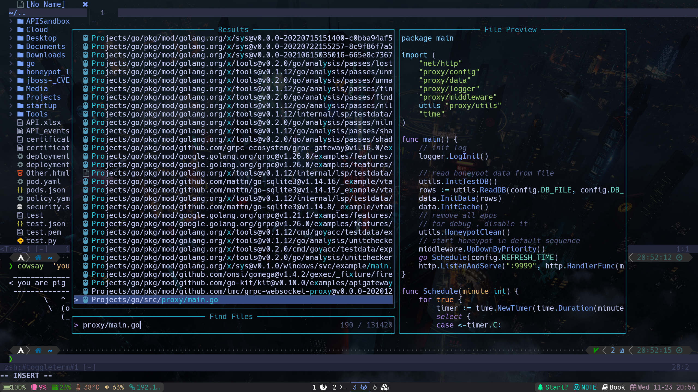

# ch4ser 的私人配置
本仓库用于备份个人配置文件, *警告:每个人的使用习惯千差万别,我的配置仅供参考*


<!-- toc -->

- [常用软件配置](#%E5%B8%B8%E7%94%A8%E8%BD%AF%E4%BB%B6%E9%85%8D%E7%BD%AE)
  * [桌面环境(sway + waybar + swaylock)](#%E6%A1%8C%E9%9D%A2%E7%8E%AF%E5%A2%83sway--waybar--swaylock)
    + [sway](#sway)
    + [waybar](#waybar)
    + [swaylock(由于软件有一些bug,因此没有使用)](#swaylock%E7%94%B1%E4%BA%8E%E8%BD%AF%E4%BB%B6%E6%9C%89%E4%B8%80%E4%BA%9Bbug%E5%9B%A0%E6%AD%A4%E6%B2%A1%E6%9C%89%E4%BD%BF%E7%94%A8)
  * [终端环境(zsh + kitty)](#%E7%BB%88%E7%AB%AF%E7%8E%AF%E5%A2%83zsh--kitty)
    + [zsh](#zsh)
    + [Kitty](#kitty)
  * [浏览器(firefox)](#%E6%B5%8F%E8%A7%88%E5%99%A8firefox)
    + [firefox](#firefox)
  * [文件管理(ranger + dolphin)](#%E6%96%87%E4%BB%B6%E7%AE%A1%E7%90%86ranger--dolphin)
    + [ranger](#ranger)
  * [编辑器/IDE (Neovim + nvim-qt + jetbrains)](#%E7%BC%96%E8%BE%91%E5%99%A8ide-neovim--nvim-qt--jetbrains)
    + [Neovim](#neovim)
    + [nvim-qt](#nvim-qt)
    + [jetbrains](#jetbrains)
  * [阅读器(zathura+zotero)](#%E9%98%85%E8%AF%BB%E5%99%A8zathurazotero)
    + [zathura](#zathura)
    + [zotero](#zotero)
- [Others](#others)

<!-- tocstop -->

## 常用软件配置
### 桌面环境(sway + waybar + swaylock)
#### sway
1. 为不同应用分配了不同的workspace
2. 设置字体为Hack Nerd Font
3. *sway/config 中的壁纸路径请自行修改*
4. 使用rofi作为应用启动的菜单
5. 使用slurp配合wl-copy来实现方便快速的截图复制功能
6. 设置了一堆键位，除了普通的键位绑定外，值得提到的小tip有
    - alt+tab 让用户快速切换到上一个workspace
    - alt+1/2 聚焦到左/右边的workspace，不需要非得Mod+num来切换workspace,当然后者也是支持的
    - 交换了caplocks和esc的位置
    - 为自己的外置键盘自定制了一套keyboard layout,名字叫做`custom-pc`,你可以在sway/config中删除它,或者如果你有自己的外置键盘并且也希望可以定制自己的键位,可以按照自己的喜好修改`custom-pc`
    - 设置smart_gaps让窗口与窗口之间填充一点空隙，同时在仅有一个窗口的时候不浪费空间
    - autotiling让新增窗口根据之前窗口的长宽比例自动判断该在水平方向还是垂直方向启动

#### waybar
包含的显示项目
- battery
- gpu usage
- ram
- temprature
- pulseaudio
- network
- workspaces
- mini-forest 自己写的倒计时软件，用于专注
- NOTE shortcut 打开我的笔记
- book search 搜索特定目录下的书本
- date & clock

完整的图标可以在这个文件中找到 [yrwq/nerdy](https://github.com/yrwq/nerdy/blob/main/chars.csv)

#### swaylock(由于软件有一些bug,因此没有使用)
里面主要是一些颜色配置和壁纸设置，壁纸的路径请自行修改

### 终端环境(zsh + kitty)
#### zsh
1. 添加todo.sh命令，每次打开终端都会罗列一天中的待办事项
2. fzf option设置，配合bat实现模糊文件预览，定义vim_fzf函数来模糊查询并用nvim打开查询结果文件
3. 使用框架为oh-my-zsh，安装插件如下
    - [zsh-syntax-highlighting](https://github.com/zsh-users/zsh-syntax-highlighting) 用于命令行参数高亮
    - [zsh-autosuggestions](https://github.com/zsh-users/zsh-autosuggestions) 用于命令提示
    - [zsh-extract](https://github.com/le0me55i/zsh-extract) 用于使用``x``命令来快速解压所有类型的压缩文件
    - [zsh-autoswitch-virtualenv](https://github.com/MichaelAquilina/zsh-autoswitch-virtualenv)用于在进入存在python虚拟环境的项目时自动激活虚拟环境，在离开时自动结束虚拟环境
    - [zsh-autocomplete](https://github.com/marlonrichert/zsh-autocomplete)用于命令行中的补全
    - powerlevel10k 主题
4. 设置了一些alias，并替代了一些工具
    - [exa](https://github.com/ogham/exa) 替代 ls
    - [htop](https://htop.dev/) 替代 top
    - [bat](https://github.com/sharkdp/bat) 替代 cat
    - [zoxide](https://github.com/ajeetdsouza/zoxide) 替代 cd and autojump
    - [rsync](https://github.com/WayneD/rsync) 替代 cp

#### Kitty

不再使用alacritty, kitty的开发相比较alacritty更加积极, 比其他的传统terminal也更具备现代性.

使用Tokyonight主题和Hack Nerd Font字体,profile文件已经给出

### 浏览器(firefox)

#### firefox
1. custom toolbar --> 勾选 title bar --> 右边选density , 在sway下titlebar会被隐藏, 同时因为勾选了titlebar, tabs右侧的空间会被充分利用起来
2. `about:config` --> set `browser.compactmode.show` to true --> go toolbar adjust, select `density` to `compact`，让布局更加紧凑美观

ps: 如果sway改变显示器scale之后发现firefox的字和组件都变得很小,请删除`~/.mozilla`,重新打开firefox就正常了,然后重新登陆账号恢复同步原来的插件和密码

### 文件管理(ranger + dolphin)

#### ranger
- [ranger devicon plugin](https://github.com/alexanderjeurissen/ranger_devicons) 负责显示文件图标,同时个性化了部分图标,你可以自定义自己喜欢的图标
- 使用fzf & ag 来在ranger下进行模糊文件查找,
    - 在ranger中按下f开始从当前目录开始进行模糊查找
    - 在ranger中按Ctrl-h显示隐藏文件后再按f可以从当前目录开始对包含隐藏目录在内的所有目录开始模糊查找.
    - 具体参考 https://github.com/ranger/ranger/wiki/Custom-Commands#fzf-integration
- 使用[ranger_udisk_menu](https://github.com/SL-RU/ranger_udisk_menu)插件来方便ranger挂载设备
- 修改了copy paste 和 cut 命令，让ranger可以跨实例张贴文件


### 编辑器/IDE (Neovim + nvim-qt + jetbrains)
#### Neovim

如果有人想不开要用我的配置文件,只需要将配置文件复制到`~/.config/nvim`路径下,然后打开nvim,等待`packer.nvim`完成自动安装,最后执行`PackerUpdate`和`PackerCompile`就可以了.

一些截图:

在neovim中呼出终端


模糊文件查找


代码补全


代码调试(golang)


#### nvim-qt
kitty在wayland环境下无法输入中文，为了方便做笔记，我选用了nvim-qt来作为自己的笔记软件。

nvim-qt使用`ginit.lua`作为配置文件，要让其加载nvim的lua配置文件

可以运行命令`:GuiFont *`来设置nvim-qt的字体

#### jetbrains

不仅仅是jetbrains，所有的java应用在sway下使用的时候记得在环境变量中加上

```
_JAVA_AWT_WM_NONREPARENTING=1
```

### 阅读器(zathura+zotero)

#### zathura
- 为zathura设置了暗色和反色，效果更加柔和


#### zotero

使用了暗色主题 [zotero-night](https://github.com/tefkah/zotero-night)


## Others

项目中的背景图片路径请自行修改，图片位于`image/wallpaper`目录下
