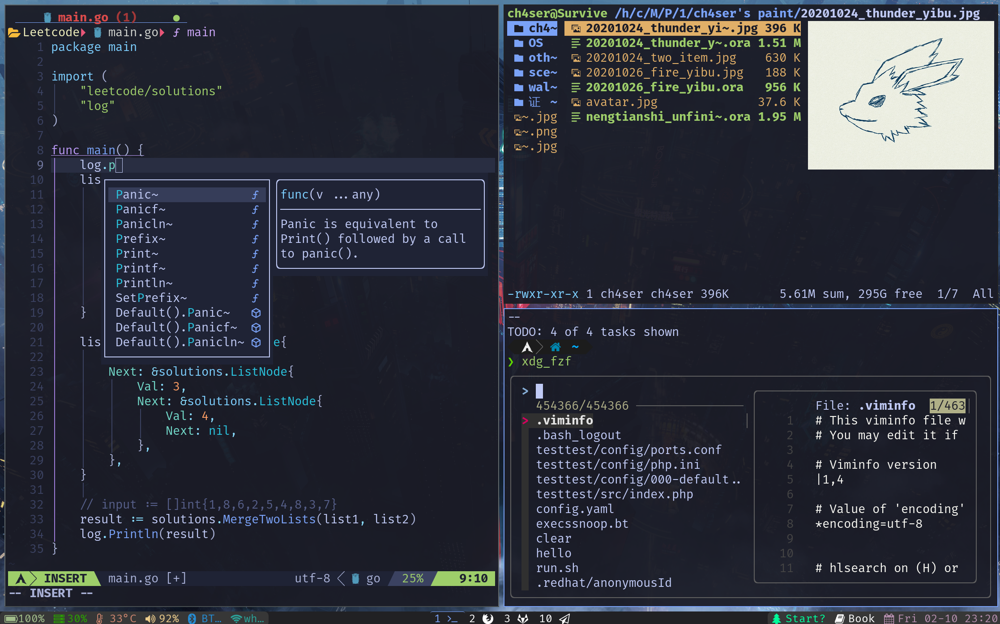

[中文介绍](./README-zh.md)
# ch4xer's personal configuration

This repo aimed to backup my configuration, including configuration of sway, waybar, neovim, alacritty, zsh and ranger. Introductions are as follows.



[TOC]

## Configuration
### DE/WM(sway + waybar + swaylock)
#### sway
1. Assign different workspaces to different applications
2. Set the font to JetBrainsMono Nerd Font Bold
3. *Please modify the wallpaper path by yourself*
4. Use rofi as the menu for application launch
5. Use slurp with wl-copy to achieve convenient and fast screenshot copy function
6. A bunch of keys are set. In addition, there are some small tips :
     - alt+tab allows users to quickly switch to the previous workspace
     - alt+1/2 focus on the left/right workspace, no need to mod+num to switch workspace
     - swap caplocks and esc positions
     - Set `smart_gaps` to fill a little gap between windows and not waste space when there is only one window
     - `autotiling` automatically determine started window direction according to the aspect ratio of the previous window

#### waybar
Including:
- battery
- gpu usage
- ram
- temprature
- pulseaudio
- network
- workspaces
- mini-forest : My personal application
- NOTE shortcut : To open my note with nvim-qt
- book search : search books in specific directory
- date & clock

#### swaylock
just some color settings and wallpaper setting

### terminal environment(zsh + alacritty)
#### zsh
1. Add todo.sh command, every time you open the terminal, it will list the to-do items of the day
2. fzf option setting, cooperate with bat to realize fuzzy file preview, and define vim_fzf function to fuzzy query and open the query result file with nvim
3. use oh-my-zsh and install the plugin as follows
     - zsh-syntax-highlighting for command line parameter highlighting
     - zsh-autosuggestions for command prompt
     - zsh-extract for fast decompression of all types of archives using the ``x`` command
     - zsh-autoswitch-virtualenv is used to automatically activate the virtual environment when entering a project with a python virtual environment, and automatically end the virtual environment when leaving
     - powerlevel10k theme
4. Set up some aliases and replace some tools
     - exa replaces ls
     - bottom instead of top
     - bat replaces cat
     - zoxide replaces cd and autojump

#### Alacritty
Using the solarized theme and Jetbrain Nerd Font, the profile file has been given


### browser(firefox)

#### firefox
1. custom toolbar --> title bar --> density
2. `about:config` --> set `browser.compactmode.show` to true --> go toolbar adjust, select `density` to `compact`


### filemanager(ranger + dolphin)

#### ranger
- use ranger_devicon_plugin to show icons,customize icons for some folders
- use fzf & ag for fuzz file finder in ranger
    - press f to start finding from current directory
    - press ctrl-h to show hidden files
    - https://github.com/ranger/ranger/wiki/Custom-Commands#fzf-integration  for details
- use ranger_udisk_menu to mount usb device
- customize copy paste and cut command to let ranger paste file in different instances


### 编辑器/IDE (Neovim + nvim-qt + jetbrains)
#### Neovim

```
.
├── gnvim.vim               // nvim-qt's configuration entry
├── init.lua                // nvim configuration entry
├── lua
│   ├── base
│   │   └── init.lua        // base config
│   ├── keymap
│   │   └── init.lua        // keymap config
│   └── plugins
│       ├── edit
│       │   └── init.lua    // plugins for editing(kommentary, todo-comment.nvim, nvim-autopairs, hop.nvim, telescope.nvim, clipboard-image.nvim, plenary.nvim, tabout.nvim)
│       ├── init.lua        // plugins' configuration entry
│       ├── interface
│       │   └── init.lua    // plugins for interface(bufferline.nvim, indent-blankline.nvim, lualine.nvim)
│       ├── lsp
│       │   └── init.lua    // lsp plugins (cmp-nvim series, nvim-treesitter, nvim-lsp-installer, nvim-dap, nvim-dap-ui, nvim-dap-go, lspsage.nvim)
│       ├── sideview
│       │   └── init.lua    // sidebar plugins(nvim-tree.lua)
│       └── theme
│           └── init.lua    // theme(tokyonight.nvim)
└── plugin
    └── packer_compiled.lua // autogenerated file, not important
```


install:
- install packer.nvim
- open lua/plugins/init.lua, comment following lines:
```
edit_plugins.load()
interface_plugins.load()
sideview_plugins.load()
theme_plugins.load()
lsp_plugins.load()
```
and save
- move configuration folder to you $XDG_CONFIG_HOME
- open neovim and run PackerInstall
- uncomment the lines above
- save and reopen
- finish

some screenshot:

call terminal in neovim


fuzzy file search


code completion


debug(golang)


#### nvim-qt
fcitx5 cannot input chinese under wayland alacritty, so I use nvim-qt for chinse note-taking.

nvim-qt use `gnvim.vim`for configuration，to load lua configuration:

`gnvim.vim`
```vim
au UIAttach * ++once lua require('init')
```
run `:GuiFont *` to set font for nvim-qt

#### jetbrains

environment variables should be added to ensure java application to run normally.
```
_JAVA_AWT_WM_NONREPARENTING=1
```

### reader(zathura)

#### zathura
- set dark color


## Others

All background wallpapers are under `image`
